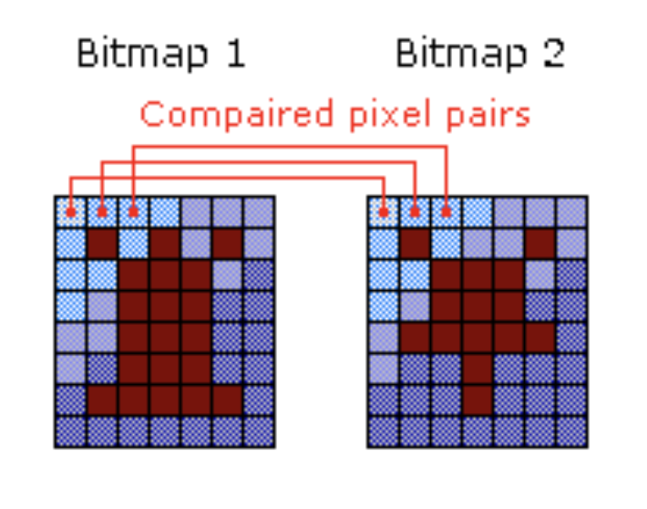

# ImageComparer

Compare images on you laptop irrespective of image extension and get comparison score based on pixel to pixel comparison.

## Algorithm Used

ImageComparer works on simple logic of breaking down images into the smallest units(pixel) and then compares each pixel at same location in corresponding images. 
# 

Based on the number of pixels matching out of total pixel, it then generates a score for the level of match between images.
The score is from 0.00 to 10.00 where a score of 0 is given to set of images which are matching 100% and a score of 10 is given to set of images which are matching 0%.

Pixel to pixel comparison is very accurate but its biggest limitation is that it requires images to be of same pixel density. Same images having different pixel density may not match 100% with a perfect 0 score.
Also, it is color sensitive which means that it will not score perfect 0 for an image when it is compared with its grayscale version.

## Prerequisites

JRE 8 or above - To download and setup JRE please follow [this](https://docs.oracle.com/goldengate/1212/gg-winux/GDRAD/java.htm#BGBFHBEA) 

## Download

It is always recommended to use the latest version of ImageComparer.
Check release history section for latest version of ImageComparer and download it from [here](https://github.com/shreejit13/ImageComparer/tree/master/dist)

## Usage

```
java -jar <latest imagecomparer.jar> -i <absolute path to input CSV file> -o <absolute path to output CSV file>
```
For example: 
```
java -jar imagecomparer.1.0.jar -i /Users/xyz/alpha/input.csv -o /Users/xyz/beta/output.csv
```

Note: If you don’t provide the input.csv path as argument then application will try to find a file name input.csv in current working directory and will run with it if found, it will also create output.csv in same location if not provided as argument.

## Release History

* 1.0
    * CHANGE: Initial release
    
## Document

### JavaDoc
You can generate code documentation using JavaDoc, please follow given below commands to create JavaDoc documentation.
```
git clone -b master https://github.com/shreejit13/ImageComparer.git
```
```
javadoc -author -private -version ImageComparer/src/main/java/ImageComparision.java -d <absolute path where to generated documents>
```
    
## Contributing

We would love your contribution to make ImageComparer more advance and bug free.
Please follow below process for submitting pull requests to us.

1. Fork master branch (https://github.com/shreejit13/ImageComparer.git)
2. Create your feature branch ```git checkout -b feature/abc```
3. Commit your changes ```git commit -am 'please add proper commit messages'```
4. Push to the branch ```git push origin feature/abc```
5. Create a new Pull Request against master branch

## Acknowledgments

* Smartbear - smartbear.com


